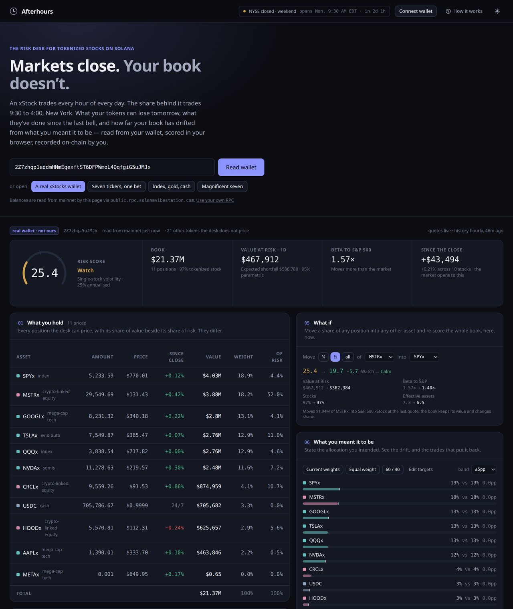

<div align="center">

# Afterhours

**The risk desk for tokenized stocks on Solana.**
**Markets close; your book doesn't.**

[**Open the desk →**](https://abhist17.github.io/afterhours/) ·
[Program on devnet](https://explorer.solana.com/address/3hqhzG55EkCjhUYmmCxHWyNGkXi3XJSTEWimkTzVifri?cluster=devnet) ·
[Submission notes](docs/SUBMISSION.md)

[](https://github.com/Abhist17/afterhours/actions/workflows/ci.yml)
[](https://github.com/Abhist17/afterhours/actions/workflows/refresh-history.yml)
[](https://github.com/Abhist17/afterhours/actions/workflows/deploy-pages.yml)

</div>



<div align="center">
<sub>A real wallet, not ours — nine xStocks and USDC, read live. MSTRx is 18% of its value and 52% of its risk.</sub>
</div>

---

## The premise

An xStock is a Solana token that tracks a share. The token trades every hour
of every day. The share trades 9:30 to 4:00, New York, on trading days.

Between the close and the next open, the token's price is a forecast of where
the stock will reopen — and the gap between the two is risk the holder carries
with nobody on the other side of the book. On a Friday night, a wallet of
tokenized stocks is a book of positions its underlying market cannot price
until Monday.

Every brokerage app shows *what you have*. None shows *what you stand to
lose* — and none of them has ever had to think about a share that keeps
trading after the bell. Afterhours is the risk desk for that book.

## What it does

Paste a Solana address, or connect a wallet. The desk reads its balances
from mainnet — sixteen xStocks, plus the SOL, USDC and USDT that sit next to
them — and scores the book in the browser:

| Panel | What it says |
|:--|:--|
| **Score** | Annualised volatility plus a concentration penalty, 0–100. An index book runs near 18; a single large-cap 30–45; a crypto-heavy book past 60. |
| **Value at Risk** | The 95% one-day loss in dollars, with Expected Shortfall — parametric and historical, the more conservative one headlines. |
| **Beta to the S&P 500** | For the book and for every position, on the same estimator, against SPYx. |
| **Since the close** | While the NYSE is closed: each stock's token move since the last official print, and the sum — *the market opens to this*. |
| **Stocks, crypto, cash** | Each sleeve's share of value beside its share of risk. Then the sentence a sector label hides: COIN, MSTR, HOOD and CRCL are equity on paper and crypto beta in practice, and the desk says what share of the book is really riding crypto. |
| **Risk of this allocation, last 30 days** | The current shape of the book, scored at every hour of the window with an estimator that has seen only what was known by then. |
| **Correlation** | Thirty days of hourly returns across what is held, plus the index. The most correlated held pair is named. |
| **Target and drift** | State the allocation you meant to hold. See the drift from it, and the trades that put it back — sized at the last quote, routed through USDC, with Jupiter prefilled. |
| **What if** | Move a quarter, a half or all of any position into any other asset and re-score the whole book, instantly. |
| **Your record on Solana** | Declare the policy on-chain. Record a snapshot. Both signed by the wallet that owns the book. |

Three sample books are built in for anyone without xStocks yet, labelled
synthetic, priced live — and one real mainnet wallet, found through the
largest SPYx token accounts and labelled as not ours. Any view is a link:
`?address=<wallet>` or `?book=<sample>`.

## Where Solana is load-bearing

**Reads.** xStocks are Token-2022 mints on mainnet. The page reads a wallet's
token accounts under both token programs, sums a mint across accounts, and
prices what it recognises. Nothing is custodied; an address is enough.

**Writes.** The [Afterhours program](https://explorer.solana.com/address/3hqhzG55EkCjhUYmmCxHWyNGkXi3XJSTEWimkTzVifri?cluster=devnet)
keeps two accounts per wallet, both owned by that wallet:

| Account | What it holds | Who writes it |
|:--|:--|:--|
| `Policy` | Target weights per mint (basis points, must sum to exactly 10,000), a risk limit, a drift band | The owner |
| `Snapshot` | Score, book value, VaR, drift from policy, share in tokenized stocks, whether the NYSE was open, timestamp — immutable | The owner |

A snapshot recorded under a policy emits `SnapshotRecorded { breached }`. That
event is the primitive a credit protocol lending against a stock portfolio
would subscribe to: not "the price moved" but "this book left its own stated
policy, by its owner's own reading".

The page prepares each transaction; the wallet signs; the page submits it to
the program's cluster. A wallet pointed at the wrong network cannot send it
anywhere else. Only the owner can create, update or close their own record.

```
instructions
  create_policy(risk_limit, drift_band_bps, targets[])
  update_policy(risk_limit, drift_band_bps, targets[])
  close_policy()
  record_snapshot(timestamp, score, value_usd_cents, var_usd_cents, drift_bps, equity_bps, market_open)
  close_snapshot()
```

Timestamps are client-chosen so a snapshot's address is derivable before the
write, and checked against the cluster clock (±15 minutes) so nobody can
backfill a flattering history.

## Nothing to run

There is no server. The site is a static export on GitHub Pages:

- **Balances** — read from mainnet by the browser.
- **Prices** — one request to the feed, every minute, from the browser.
- **History** — thirty days of hourly prices for the whole universe, refreshed
  on the hour by a [GitHub Action](.github/workflows/refresh-history.yml)
  and published as one file on the `data` branch; a copy is bundled with the
  build so a first paint never depends on a third party being up.
- **Arithmetic** — every figure on the page is computed in the tab.
- **On-chain** — signed by the viewer's own wallet.

Nothing sleeps, nothing has a cold start, and nothing about a book leaves the
browser except what its owner chooses to sign.

> **On RPCs.** Solana's public mainnet endpoint refuses browser-origin
> token-account queries with a 403, and most keyless alternatives gate them.
> [Solana Vibe Station](https://solanavibestation.com)'s public endpoint
> answers them with CORS open, so it is the default; a build can carry its
> own key as `NEXT_PUBLIC_RPC_URL` (a free [Helius](https://helius.dev) key,
> restricted to the site's domain), and any viewer can paste an endpoint,
> kept in their browser. Each failure falls through to the next.

## The universe

Sixteen xStocks and three neighbours, in [one table](app/data/universe.json)
that both the app and the refresh script read. Every mint was checked against
CoinGecko's Solana platform entry and then against the account on mainnet —
owner program and decimals. That found every xStock to be a Token-2022 mint
with 8 decimals, and CoinGecko listing AMDx with 18.

| Sector | Tickers |
|:--|:--|
| Index | SPYx, QQQx |
| Mega-cap tech | AAPLx, MSFTx, GOOGLx, AMZNx, METAx |
| Semis | NVDAx, AVGOx, AMDx |
| EV | TSLAx |
| Crypto-linked equity | COINx, MSTRx, HOODx, CRCLx |
| Commodity | GLDx |
| Crypto · cash | SOL · USDC, USDT |

## How the numbers are made

- **Returns** are hourly, from thirty days of prices; the sampling interval
  is measured from the data's own timestamps, not assumed.
- **Covariance** is exponentially weighted with the RiskMetrics decay,
  rescaled so its memory is seventeen *days* on hourly data rather than
  seventeen hours.
- **VaR** is reported two ways — normal-curve on that covariance, and
  historical simulation on compounded one-day returns — and the larger
  headlines. Expected Shortfall is the mean loss beyond it.
- **Attribution** is Euler allocation: component VaRs sum exactly to the
  total, so "COINx is 15% of value and 22% of risk" is a decomposition, not a
  heuristic.
- **Beta** is covariance with SPYx over its variance, on the same estimator.
- **The score** is annualised volatility — over the 365-day calendar the
  token keeps, since the daily sigma is measured over every calendar day —
  plus a continuous concentration penalty for a dominant position or too few
  effective names. Bands: Calm below 25 (index-fund volatility), Watch to 45
  (a single stock), Elevated to 70 (crypto-grade), Severe above.
- **The backtest** seeds its recursive covariance from the first week's
  sample covariance, so the chart is the book's risk, not the estimator
  filling its memory.
- **Market hours** are computed in `America/New_York` through `Intl`, with
  NYSE holidays and early closes through 2027, so daylight saving is the
  platform's problem.

The estimators share their design with the author's earlier engine,
[Sentra](https://github.com/Abhist17/sentra) (MIT). Beta, the backtest, drift,
market hours and everything about stocks are new here.

## Development

```bash
git clone https://github.com/Abhist17/afterhours
cd afterhours/app
npm install
npm run dev                 # http://localhost:3000
npm test                    # quant, market hours, portfolio assembly, on-chain encoding
npm run build               # static export to out/

cd ..
node scripts/refresh-history.mjs   # rebuild app/public/data/history.json
anchor test                        # 12 program tests on a local validator
```

| Layer | Technology |
|:--|:--|
| App | Next.js 16 static export · React 19 · Tailwind 4 · hand-rolled SVG |
| Wallet | Wallet Standard via `@solana/wallet-adapter-react` |
| Program | Rust · Anchor 0.32 |
| Data | Solana mainnet RPC · CoinGecko · GitHub Actions |

## Not investment advice

Every figure is a model estimate built from thirty days of prices. Value at
Risk assumes tomorrow rhymes with the recent past; a model that has never
seen a crash cannot price one. xStocks are issued by Backed Finance;
Afterhours is unaffiliated with them, with the exchanges, and with the
companies whose shares the tokens track.
